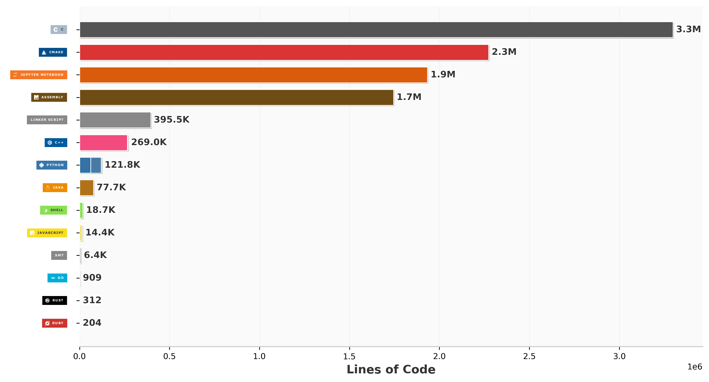

## 👋 Hi there, I am Kasthuri  

* She/Her
* Studying security and cloud computing (<a href="https://www.secclo.eu/">SECCLO</a>)
* Reach me on ✉️ kasthurisopanam@gmail.com

## Tech Stack

  
  
  
  
  
  
  
  

## GitHub Stats

  

 

#### Trying to build a good profile (2026 resolution 😌)

## Currently 

- Writing my thesis in formal verification of GMW protocol 
- Also learning Finnish
- Trying to actively build systems

## Interests

- Pen testing
- GenAI application developments
- Cryptography